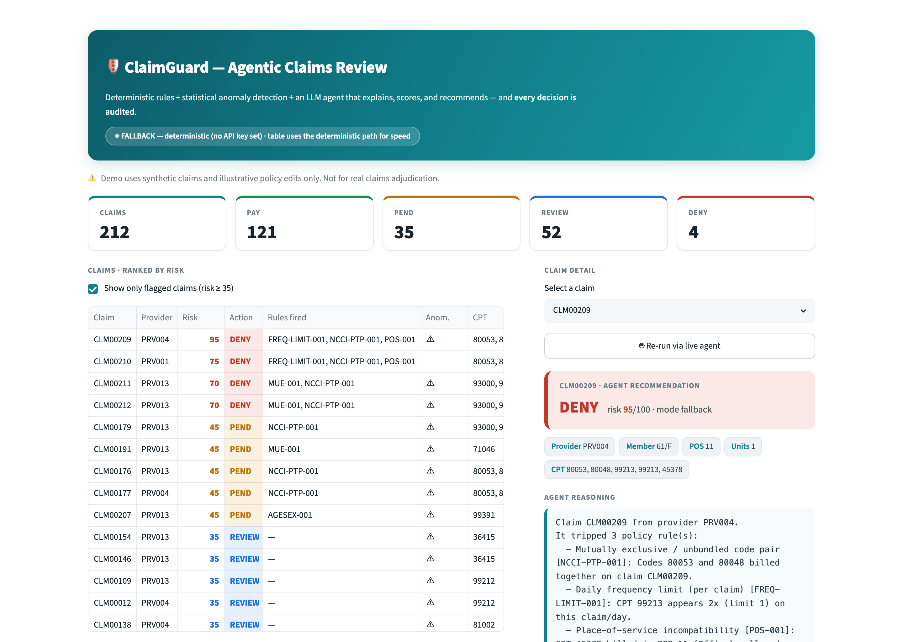

# 🛡️ ClaimGuard

**An agentic claims-review demonstrator for healthcare payment integrity.**

ClaimGuard ingests synthetic medical claims, detects payment anomalies with a
**deterministic rules engine** + a **statistical outlier layer**, then an **LLM
agent produces a structured, evidence-grounded decision rationale**, a risk score
(0–100), and a recommended action (**PAY / PEND / DENY / REVIEW**) with citations
back to the policy it triggered. Every decision emits a structured, replayable
**audit event**, and a small Streamlit dashboard visualizes the whole flow.

> **Thesis:** agentic detection is the easy part — *governing* those agents
> (explainability, audit trails, human-in-the-loop, trust scoring) is the real
> unlock for a regulated payment-integrity company. The **audit layer** is what
> sells that.

---

## 🎯 How this maps to the Cotiviti assessment

- **Topic chosen:** Clinical Decision Making and Pattern Recognition in Health Care
- **Healthcare area:** Payment integrity / claims review (TPO)
- **Agentic AI:** LLM-based decision agent (`claude-sonnet-4-6`) with a deterministic fallback
- **Pattern recognition:** provider-level CPT outlier detection (peer fence + z-score)
- **Classification / inference:** risk scoring + recommended action (PAY / PEND / DENY / REVIEW)
- **Governance:** replayable audit events, policy citations, human-in-the-loop review
- **Deliverables:** report, POC code, slide deck, and MP4 video (in [`submission/`](submission/))

---

## 📦 Submission artifacts

This repository is the Cotiviti intern take-home submission by **Aryan Nagwekar**.
The supporting deliverables live in [`submission/`](submission/):

- 📄 `Cotiviti_Report_AryanNagwekar.docx` — the written report
- 📊 `Cotiviti_Deck_AryanNagwekar.pptx` — the slide deck
- 🎬 `Cotiviti.mp4` — the recorded demo walkthrough
- 📑 `Cotiviti.pdf` — report (PDF copy)

The **MP4 walkthrough** covers, in order:

1. PowerPoint overview
2. CLI pipeline execution (`pipeline.py --run-all`)
3. Audit replay (`audit.py <CLAIM_ID>`)
4. Streamlit dashboard
5. Human-in-the-loop override

---

## 🖼️ Screenshots




---

## ⏱️ 60-second quickstart

```bash
cd claimguard
pip install -r requirements.txt

python src/generate_data.py        # 1. write ~212 synthetic claims (seed 42)
python -m pytest -q                 # 2. rules engine: 10 tests green
python src/pipeline.py --run-all    # 3. full pipeline + summary table
streamlit run app/dashboard.py      # 4. open the dashboard
```

No API key required — the agent runs in a **deterministic fallback mode** out of
the box and prints a clear note when it does. To use the live Anthropic agent:

```bash
export ANTHROPIC_API_KEY=sk-...     # see .env.example
python src/pipeline.py --claim CLM00209
```

If the key is unset or any call fails, ClaimGuard **never hard-fails** — it falls
back to deterministic, templated reasoning composed from the rule/anomaly outputs.

---

## 🧩 Every module runs standalone

```bash
python src/generate_data.py --seed 42   # regenerate the dataset
python src/rules_engine.py              # print all rule violations
python src/anomaly.py                   # print provider outliers
python src/agent.py                     # sample agent decisions (live or fallback)
python src/pipeline.py --claim CLM00209 # one claim, end-to-end, verbose
python src/audit.py CLM00209            # replay a claim's audit trail
```

---

## 🗺️ Architecture

See [`docs/architecture.md`](docs/architecture.md) for the diagram and a paragraph
per module. In short:

```
policies.yaml ─┐
synthetic_claims.csv ─► rules_engine ─┐
                       anomaly ───────┤► agent (LLM + fallback) ─► audit (events.jsonl)
                                       └──────────────► pipeline (CLI) ─► dashboard (UI)
```

**Tech stack (intentionally boring):** Python 3.11+, `pandas`, `pyyaml`,
`streamlit`, `anthropic` (`claude-sonnet-4-6`), `pytest`. Flat files only — no DB,
auth, queues, Docker, or cloud.

---

## 🎬 Demo video walkthrough (exact click-path)

1. **Terminal — the pipeline works headless.** Run `python src/pipeline.py --run-all`.
   Point out: it announces **FALLBACK mode**, processes 212 claims, and prints the
   action breakdown (**PAY / PEND / DENY / REVIEW**) and the **top-10 highest-risk**
   table. (`CLM00209` should be top at risk 95 → DENY.)
2. **Terminal — explainability + audit.** Run `python src/audit.py CLM00209`. Show
   the **replayable audit event**: the 3 rules it fired, their **citations**, the
   anomaly flag, the risk/action, and the full decision rationale. This is the
   governance story.
3. **Dashboard — the product view.** `streamlit run app/dashboard.py`.
   - Show the **metrics row** and the **risk-sorted table**.
   - Select **`CLM00209`** → read the agent reasoning, expand each **rule + citation**,
     show the **anomaly signal** and the **raw audit event** JSON.
   - Select an **anomaly-only** claim (e.g. a `PRV013` / `36415` claim) → show it's
     **REVIEW** (anomaly, no hard rule hit) — pattern recognition without a rule.
   - Demonstrate **human-in-the-loop**: choose **Override**, pick a new action,
     **Record disposition**.
   - *(Optional, if `ANTHROPIC_API_KEY` is set)* click **🤖 Re-run via live agent**
     to show the same decision produced by `claude-sonnet-4-6` (`mode: live`).

---

## 📌 Assumptions & scope

- **Illustrative policies.** Rules and citations in `policies.yaml` are plausible,
  synthetic encodings of real concepts (NCCI PTP, CMS MUE, frequency/POS/age-sex
  editing) — **not legally exact**. Labeled as such in the file.
- **Synthetic data.** All claims, providers, members, and charges are generated and
  fictional.
- **Frequency limit** is modeled as a per-claim duplicate-code check (a CPT
  appearing more than its allowed count on one claim/day), keeping the rules engine
  pure per-claim.
- **Dashboard table** uses the deterministic agent path for a fast, bulletproof
  load; the **live** LLM path is exercised per-claim via the CLI or the dashboard's
  "Re-run via live agent" button to avoid 200+ API calls on startup.
- **No persistence** for human-in-the-loop dispositions (in-memory per session, by
  design).
