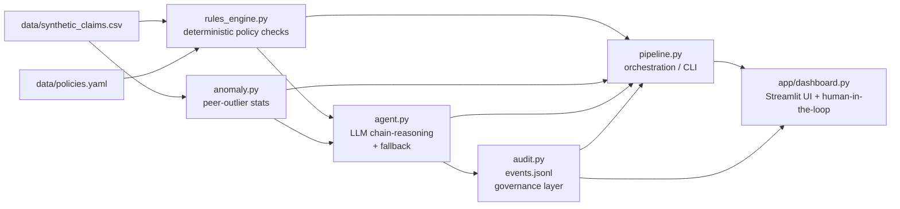

# ClaimGuard — Architecture

## Flow

The thesis: **agentic detection is the easy part; governing those agents —
explainability, audit trails, human-in-the-loop, trust — is the real unlock for
a regulated payment-integrity company.** `audit.py` is that governance layer.

## Modules

- **`data/policies.yaml`** — Five illustrative payment-integrity rules (mutually
  exclusive/unbundled pairs, daily frequency limits, MUE unit caps, place-of-service
  incompatibility, age/sex appropriateness). Each rule carries an `id`, `type`,
  `params`, and a plausible NCCI/CMS-flavored `citation` string. Clearly labeled
  illustrative, not legally exact.

- **`src/generate_data.py`** — Seeded (`--seed 42`), reproducible generator that
  writes ~212 synthetic claims, deliberately injecting ~17% rule violations, a few
  egregious multi-rule claims (to produce DENYs), and one statistical-outlier
  provider (`PRV013` over-billing CPT `36415`).

- **`src/rules_engine.py`** — Pure, deterministic functions. Input: one normalized
  claim + loaded policies. Output: a list of `RuleViolation(rule_id, name, citation,
  detail)`. No LLM, no I/O in the check logic. Also owns claim loading/normalization.

- **`src/anomaly.py`** — Simple, explainable statistics over the whole dataset. For
  each CPT it compares a provider's volume to peers using a Tukey upper fence
  (median + 1.5·IQR) gated by a z-score, emitting a `ProviderAnomaly` per flag. No
  ML training.

- **`src/agent.py`** — The agentic layer. Builds a prompt from the claim facts,
  tripped rules (with citations), and anomaly signal; calls Anthropic
  `claude-sonnet-4-6` for JSON-only output (reasoning, risk_score, action,
  citations) parsed safely. If the key is missing or any call/parse fails, it
  deterministically composes the same fields (`mode="fallback"`) so the demo never
  hard-fails.

- **`src/audit.py`** — The governance centerpiece. Emits one replayable JSON line
  per decision to `audit_log/events.jsonl` (timestamp, decision_id UUID, claim
  summary, rules fired, anomaly flag, model, mode, risk, action, reasoning,
  citations) and can pretty-print the trail for any claim.

- **`src/pipeline.py`** — Orchestrates one claim end-to-end (rules → anomaly →
  agent → audit). `--run-all` processes the whole CSV and prints a summary table
  (counts by action, top-risk claims). The CLI spine of the demo.

- **`app/dashboard.py`** — Streamlit UI: sortable risk-ranked table, per-claim
  detail (reasoning, rules + citations, anomaly, raw audit event), a "re-run via
  live agent" button, and a human-in-the-loop Approve/Override control.
